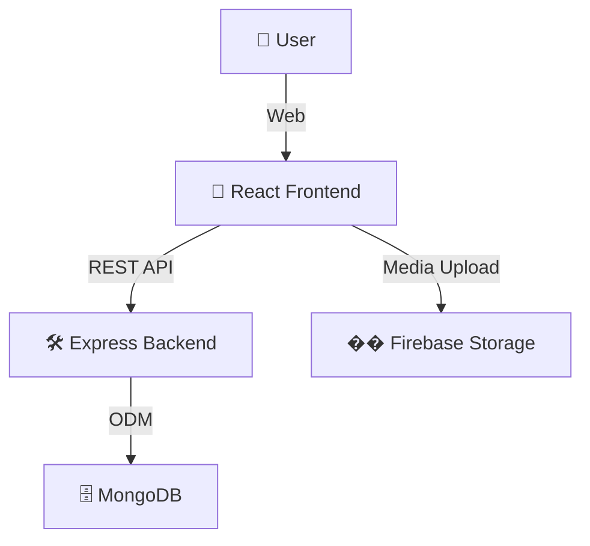

# 🍲 RecipeApp

---
## 🌍 Live Demo

Check out the live app here: [https://recipeshareapp.netlify.app/](https://recipeshareapp.netlify.app/)

# 📖 Table of Contents

- [Overview](#-overview)
- [Tech Stack](#-tech-stack)
- [System Architecture](#-system-architecture)

---

## 🌐 Overview

**RecipeApp** is a full-stack web application for food lovers to **explore**, **share**, and **discuss** recipes from all over the world. It’s built for a community that loves cooking and experimenting with new dishes. Users can contribute their own recipes, interact with others through comments and feedback, and enjoy a rich, user-friendly interface.

> With an emphasis on **usability**, **scalability**, and **community-driven content**, RecipeApp is your one-stop destination for all things culinary.

---

## 🚀 Tech Stack

### 🖥️ Frontend

- **React.js** (with React Router)
- **Redux & Redux Persist**
- **Tailwind CSS** (modern utility-first styling)
- UI Libraries:  
  - `react-icons`, `react-typed`, `swiper`, `react-quill`
- **Firebase** (image/video storage)

### 🛠️ Backend

- **Node.js** with **Express.js** (REST APIs)
- **MongoDB** with **Mongoose**
- **JWT** (authentication)
- **bcrypt.js** (password hashing)
- Utilities: `cors`, `dotenv`

### ⚙️ DevOps & Deployment

- **Docker** (for both client and server)
- **Vite** (lightning-fast frontend builds)
- **Nodemon** (backend development)

---

## 🏗️ System Architecture



* Frontend ↔️ Backend via REST APIs  
* Backend handles auth, recipes, users, feedback  
* MongoDB for structured data storage  
* Firebase for handling media assets  

---

## ✨ Features

* 🔐 **User Authentication** (Sign up, Login, Profile Management)
* 🧑‍🍳 **Share Recipes** (With detailed ingredients, steps, images & videos)
* 📖 **Explore Recipes** (Search, Filter, and View recipe details)
* ❤️ **Engage** (Like, Comment, Rate recipes)
* 🧾 **Testimonials** (Post and read platform feedback)
* 📱 **Responsive UI** (Fully mobile and desktop optimized)
* 🔍 **Search & Pagination** (Smooth browsing experience)

---

## 📁 Folder Structure

```bash
RecipeApp/
│
├── client/           # React frontend
│   ├── src/
│   │   ├── components/   # UI Components
│   │   ├── api/          # API calls
│   │   ├── redux/        # State management
│   │   ├── assets/       # Images, icons
│   │   └── firebase.js   # Firebase configuration
│
└── server/           # Node.js backend
    ├── controllers/   # Route handlers
    ├── models/        # MongoDB schemas
    ├── routes/        # API endpoints
    └── index.js       # Entry point
```

---

## 🧑‍💻 Getting Started

### ✅ Prerequisites

* Node.js (v18+ recommended)
* MongoDB (local or Atlas)
* Firebase project
* Docker (optional)

### ⚙️ Installation

1. **Clone the repository**
    ```bash
    git clone <repo-url>
    cd RecipeApp
    ```

2. **Configure Environment**

    * `server/.env`: Add Mongo URI, JWT secret, etc.
    * `client/src/firebase.js`: Add Firebase config.

3. **Install dependencies**
    ```bash
    cd client
    npm install
    cd ../server
    npm install
    ```

4. **Run the App**

    * Frontend: `npm run dev` (from `client/`)
    * Backend: `npm run dev` (from `server/`)

5. **(Optional) Run with Docker**

    * Build and run containers using `Dockerfile` and `docker-compose.yml`

---

## 📡 Sample API Endpoints

| Method | Endpoint                   | Description         |
| ------ | -------------------------- | ------------------- |
| `POST` | `/api/users/signup`        | Register a user     |
| `POST` | `/api/users/login`         | Authenticate a user |
| `GET`  | `/api/recipes`             | Fetch all recipes   |
| `POST` | `/api/recipes`             | Add a new recipe    |
| `GET`  | `/api/recipes/:id`         | Get recipe details  |
| `PUT`  | `/api/recipes/:id`         | Update a recipe     |
| `POST` | `/api/recipes/:id/like`    | Like a recipe       |
| `POST` | `/api/recipes/:id/comment` | Comment on a recipe |

---

## 🔮 Future Scope

* 🎯 **Personalized Recommendations**
* 🌐 **Social Features** (Follow, Groups, Sharing)
* 🔍 **Advanced Filters** (Cuisine, Cook time, Dietary needs)
* 📺 **Interactive Cooking** (Live sessions, Chef Q&A)
* 📱 **Mobile App** (Android/iOS)
* 🔔 **Notifications** (Real-time updates)
* 🛡️ **Admin Dashboard** (Manage content/users)

---

## 🤝 Contributing

All contributions are welcome 🙌

* Fork the repository
* Create a new branch (`feature/your-feature`)
* Submit a pull request
* For major changes, open an issue for discussion first

---

## 📝 License

This project is currently unlicensed. Contact the author for usage permissions

---

## 📬 Contact

📧 Email: [kumarayushjha123@gmail.com](mailto:kumarayushjha123@gmail.com)

---

Made with ❤️ by **Ayush Kumar Jha**

---
